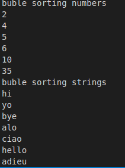

# bubble-sort
Sorting an array of numbers or strings in ascending order




The `#bubble_sort` method takes an `array` as an `argument` and returns the sorted `array`. 
Output Example:

```ruby
p bubble_sort([5, 4, 3, 2, 1, 8, 9, 7, 6])
## => [1, 2, 3, 4, 5, 6, 7, 8, 9]
```

The `#bubble_sort_by` method takes an `array` as an `argument`, and a `block`, and returns the sorted `array`. Output Example:

```ruby
sample = bubble_sort_by(%w[hi hello hey]) do |left, right|
  left.length - right.length
end
```
## => ["hi", "hey", "hello"]

## Built With


- Visual Studio Code

## Getting Started

Try out in interactive ruby shell with these commands

- copy code from [raw code](https://github.com/AshakaE/bubble-sort/blob/development/bubble_sort.rb)
- `open terminal or cmd and type 'irb'` **must have ruby installed** 
- `paste copied code and hit enter`

## Authors

👤 **Saima**

- GitHub: [@saimaAnis21](https://github.com/saimaAnis21)
- Twitter: [@SheTALKS](https://twitter.com/SheTALKS6)
- LinkedIn: [Saima Anis](https://www.linkedin.com/in/saima-anis-3a07921b2/)

👤 **Ashaka**

- Github : [AshakaE](https://github.com/AshakaE)
- Twitter : [shaqzee](https://twitter.com/shaqzee_)

## 🤝 Contributing

Contributions, issues, and feature requests are welcome!


## Show your support

Give a ⭐️ if you like this project!

## 📝 License

Copyright 2020 Saima Anis

Permission is hereby granted, free of charge, to any person obtaining a copy of this software and associated documentation files (the "Software"), to deal in the Software without restriction, including without limitation the rights to use, copy, modify, merge, publish, distribute, sublicense, and/or sell copies of the Software, and to permit persons to whom the Software is furnished to do so, subject to the following conditions:

The above copyright notice and this permission notice shall be included in all copies or substantial portions of the Software.

THE SOFTWARE IS PROVIDED "AS IS", WITHOUT WARRANTY OF ANY KIND, EXPRESS OR IMPLIED, INCLUDING BUT NOT LIMITED TO THE WARRANTIES OF MERCHANTABILITY, FITNESS FOR A PARTICULAR PURPOSE AND NONINFRINGEMENT. IN NO EVENT SHALL THE AUTHORS OR COPYRIGHT HOLDERS BE LIABLE FOR ANY CLAIM, DAMAGES OR OTHER LIABILITY, WHETHER IN AN ACTION OF CONTRACT, TORT OR OTHERWISE, ARISING FROM, OUT OF OR IN CONNECTION WITH THE SOFTWARE OR THE USE OR OTHER DEALINGS IN THE SOFTWARE.
